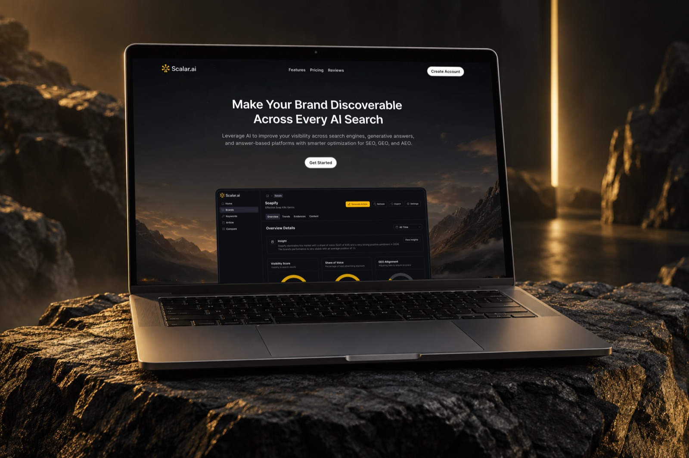
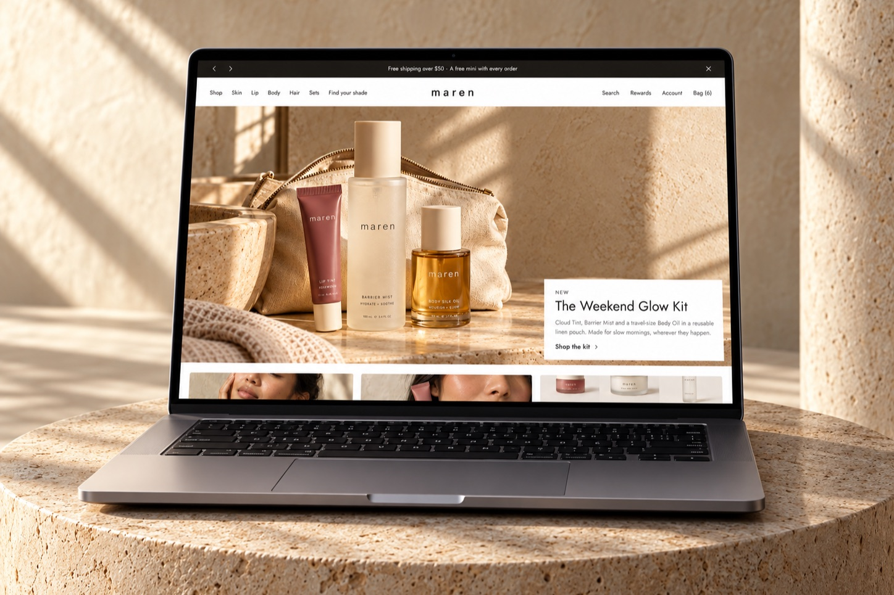
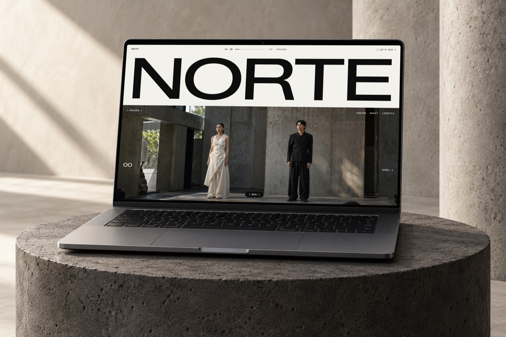
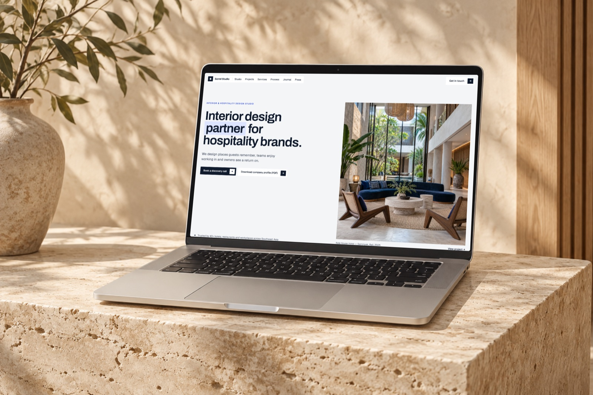

# Template Vibe Code

Free website templates (landing pages, company profiles, storefronts) you can grab and use for your own projects. [MIT licensed](LICENSE).

Each template is a **standalone app** in `apps/` with its own dependencies, fonts, and assets. Take one folder and it builds on its own.

---

## Templates

<table>
<tr>
<td width="50%"><a href="https://yohanesnickscalar.vercel.app"></a><br /><b>Scalar.ai</b> · <a href="apps/scalar-ai">apps/scalar-ai</a></td>
<td width="50%"><a href="https://yohanesnickmarenbotanical.vercel.app"></a><br /><b>Maren Botanical</b> · <a href="apps/maren-botanical">apps/maren-botanical</a></td>
</tr>
<tr>
<td width="50%"><a href="https://yohanesnicknorte.vercel.app"></a><br /><b>Norte Studio</b> · <a href="apps/norte-studio">apps/norte-studio</a></td>
<td width="50%"><a href="https://yohanesnicksorrel.vercel.app"></a><br /><b>Sorrel Studio</b> · <a href="apps/sorrel-studio">apps/sorrel-studio</a></td>
</tr>
</table>

| Template | Description | Live demo | Folder |
|---|---|---|---|
| Scalar.ai | SaaS landing page for an AI visibility platform (SEO, GEO, AEO) | [yohanesnickscalar.vercel.app](https://yohanesnickscalar.vercel.app) | [`apps/scalar-ai`](apps/scalar-ai) |
| Maren Botanical | Beauty storefront with a shade carousel | [yohanesnickmarenbotanical.vercel.app](https://yohanesnickmarenbotanical.vercel.app) | [`apps/maren-botanical`](apps/maren-botanical) |
| Norte Studio | Editorial landing page for a fashion, beauty & lifestyle studio | [yohanesnicknorte.vercel.app](https://yohanesnicknorte.vercel.app) | [`apps/norte-studio`](apps/norte-studio) |
| Sorrel Studio | Company profile for an interior & hospitality design studio | [yohanesnicksorrel.vercel.app](https://yohanesnicksorrel.vercel.app) | [`apps/sorrel-studio`](apps/sorrel-studio) |

Each template's README covers its stack, local port, Figma file, and where to edit content. The full showcase lives on my portfolio: [yohanesnick.site/work](https://yohanesnick.site/work) (Vibe Code section).

---

## Using a Template

Grab a single template without cloning the whole repo:

```bash
npx degit yohanes66/templatevibecode/apps/sorrel-studio my-site
cd my-site

npm ci
npm run dev
```

Replace `sorrel-studio` with the folder you want (see the table above). Every template is self-contained, so the folder you get from `degit` builds and deploys as is.

Before you use it for a real website:

- Replace the demo content: brand name, copy, metrics, contact details, social links. The **Editing** section of each template's README tells you where they live.
- Replace the photos and images with your own. The bundled images are there to show the layout.
- Self-hosted fonts are OFL licensed. The license files are in `public/fonts/`.

To clone every template at once:

```bash
git clone https://github.com/yohanes66/templatevibecode.git
cd templatevibecode/apps/<template-name>
npm ci
npm run dev
```

---

## Repository Structure

```text
templatevibecode/
├── apps/                     # 1 folder = 1 standalone app with its own package.json
│   ├── scalar-ai/
│   ├── maren-botanical/
│   ├── norte-studio/
│   └── sorrel-studio/
│
├── docs/
│   ├── ADD_NEW_PROJECT.md    # How to add a new template
│   ├── README_TEMPLATE.md    # README format for each template + checklists
│   └── VERCEL_SETUP.md       # Per-template Vercel deployment
│
├── AGENTS.md                 # Rules for coding agents (Codex, Claude Code)
├── LICENSE                   # MIT
├── .gitignore
└── README.md
```

There is no root `package.json` and no workspace. Install and run each app from its own folder.

---

## Maintaining This Repo

### Adding a template

1. Create a **kebab-case** folder in `apps/`, e.g. `apps/fintech-dashboard`.
2. Scaffold the app with whatever stack suits the design.
3. Add a `README.md` following [`docs/README_TEMPLATE.md`](docs/README_TEMPLATE.md) and a `cover.jpg` thumbnail.
4. Make sure `npm run build` passes.
5. Add the template to the gallery and the table above.
6. Create a new Vercel project whose Root Directory points to the folder.

Full workflow: [`docs/ADD_NEW_PROJECT.md`](docs/ADD_NEW_PROJECT.md).

### Deployment

All templates deploy from this one GitHub repo. Each Vercel project uses a different **Root Directory**:

| Vercel project | Root Directory |
|---|---|
| `scalar.ai` | `apps/scalar-ai` |
| `marenbotanical` | `apps/maren-botanical` |
| `norte` | `apps/norte-studio` |
| `sorrel-studio` | `apps/sorrel-studio` |

Pushing to `main` deploys to production. Don't move or rename an app folder without updating its Root Directory in Vercel. Setup details: [`docs/VERCEL_SETUP.md`](docs/VERCEL_SETUP.md).

### Principles

- **Isolated.** Each template is its own website, not a page inside a bigger site. No navigation between templates.
- **Any stack.** Templates can use different frameworks and tooling depending on the design.
- **No shared UI package.** Each template has its own visual identity. A shared package only makes sense for technical utilities (analytics, SEO), never for a design system.
- **Just enough structure.** Small templates can stay simple. Don't add architecture for the sake of consistency.

### Commits

One commit, one app. Keep messages short and lowercase:

```text
add scalar ai landing page
fix mobile layout for scalar ai reviews
optimize images for fintech dashboard
```
