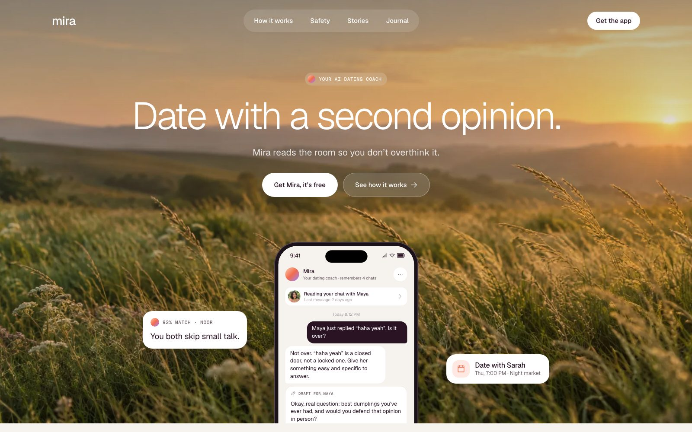

# Mira



Landing page and interactive app demo for Mira, a fictional AI dating coach. The look borrows the calm, conversational style of AI fintech sites (light grotesk type, restrained palette, a chatty AI voice) with its own story: one chapter for each moment of dating, from the first like to the date debrief.

| | |
|---|---|
| Live demo | [yohanesnickmiradating.vercel.app](https://yohanesnickmiradating.vercel.app) |
| Type | Landing page + app demo |
| Stack | TanStack Router, React, Vite, TypeScript, CSS, GSAP, Phosphor Icons |
| Design | Coming soon |
| Vercel | Project `mira-dating`, Root Directory `apps/mira-dating` |
| Local port | 3500 |

## Getting Started

Requires Node.js 22.18+ (Node 24 recommended).

```bash
npm ci
npm run dev        # http://127.0.0.1:3500
```

| Script | What it does |
|---|---|
| `npm run dev` | Dev server |
| `npm run build` | Type check + production build to `dist/` |
| `npm run preview` | Preview the build |

## Features

- **Video hero with depth.** A quiet meadow loop uses a 1600×900 desktop video or a lighter 720×960 portrait video. It has no audio, a still-image fallback, and a pause button. Playback stops outside the hero or in a hidden tab; reduced motion and Save-Data skip the video download. On scroll the background, headline, phone, and floating cards move at different speeds. On desktop they also shift slightly with the cursor.
- **Calm intro.** The headline rises word by word, then the phone mockup slides up, the cards fade in, and the chat inside the phone plays with a typing indicator.
- **Four story chapters** (match, chat, date, debrief). Each pairs a model photo, illustration, or phone mockup with a UI card, and the elements fade up softly on scroll. The debrief chapter plays its own chat sequence.
- **Quiet scroll effects.** The statement photo drifts slower than the page, sections reveal with a short stagger, and the nav turns into a flat solid bar after the hero.
- **Interactive demo (`/app`, not linked from the landing).** Ask Mira with quick replies and a typing indicator, Discover with pass/like that swipes through three profiles, and Chats. The phone mockups on the landing page reuse these same screen components.
- **Responsive** from 390px to 1440px+. All motion is off for `prefers-reduced-motion`.

## Editing

| File | Contents |
|---|---|
| `src/content.ts` | All copy, chapters, stories, store links, profiles, chats, and canned AI replies |
| `src/App.tsx` | Landing sections, `/app` demo, routes |
| `src/screens.tsx` | Mobile app screens (Discover, Ask Mira, Chats) and the phone mockup |
| `src/motion.ts` | Every GSAP animation and ScrollTrigger |
| `src/styles.css` | Design tokens, layout, breakpoints |
| `public/images/` | 16 WebP images |
| `public/videos/` | Two optimized H.264 meadow loops, desktop and portrait |
| `public/fonts/` | Geist and Geist Mono with their OFL licenses |

## Notes

- All photos and illustrations are AI-generated and fictional. The prompts are in `image-prompts.json`.
- The chat uses canned replies (`replies` in `src/content.ts`). Nothing is sent anywhere.
- To replace the hero video, update both files in `public/videos/` and use a frame from the video for `public/images/meadow.webp`. Keep MP4/H.264, no audio, and fast-start metadata. The source variant is chosen once when playback starts; resizing uses `object-fit: cover` without downloading a second video.
- “Get Mira, it’s free” and “Get the app” scroll to the download section. Put your App Store and Google Play URLs in `storeLinks` in `src/content.ts`.
- Mira, its reviews, and its numbers are demo content.

## QA

[`docs/design-qa.md`](docs/design-qa.md)
